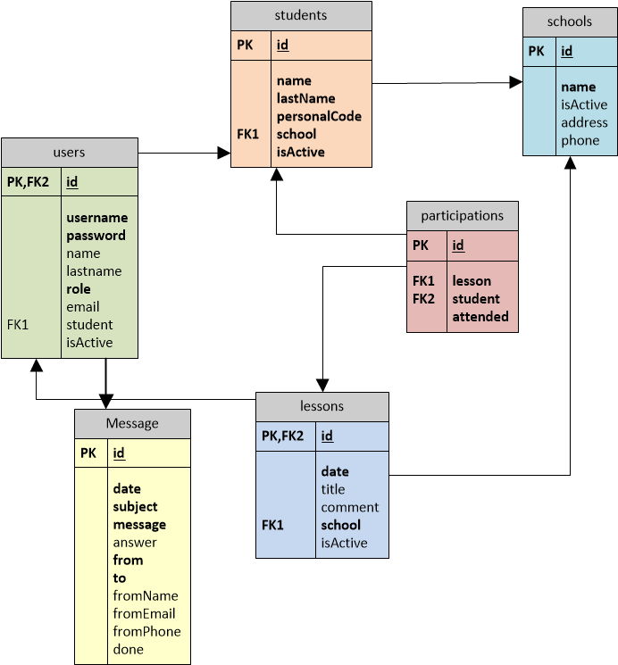

<h2>Extra Lessons Application</h2>
<h3>Purpose:</h3> 
Developing an application that allows to monitor class attendance both from the teacher and from the parent side and also provide automated calculation for generating monthly payments.

<h3>Team Members:</h3>
Ekaterina Kondratyeva (Frontend/Backend Developer), Olga Vinogradova (Frontend/Backend Developer), Valeria Zalygina (Frontend/Backend Developer)

<h3>Technologies and languages:</h3> Spring Boot, Spring Data JPA, Java, HTML, CSS, Bootstrap, JavaScript, MySql, Trello, Figma

<h3>Functionalities:</h3>
<table class="table table-striped table-bordered">
        <thead>
        <tr>
            <th scope="col">Unregistered user</th>
            <th scope="col">Teacher</th>
            <th scope="col">Parent</th>
            <th scope="col">Moderator</th>
        </tr>
        </thead>
        <tbody>
        <tr>
            <td>View common pages: Main page, About project and Login</td>
            <td>Chose a school for current work</td>
            <td>Check attendances</td>
            <td>View list of users, create, update, deactivate user</td>
        </tr>
        <tr>
            <td>Send message to Moderator</td>
            <td>View a list of lessons by selected school, create lesson, update lessons created by a logged in teacher not more than 15 days ago</td>
            <td>Print invoice</td>
            <td>View list of schools, create, update, deactivate school</td>
        </tr>
        <tr>
            <td></td>
            <td>View list of students by selected school, add new student, edit student’s data (when adding a student and his personal code, a parent user account is created)</td>
            <td>View and update profile</td>
            <td>View list of students, create, update, deactivate student</td>
        </tr>
        <tr>
            <td></td>
            <td>View monthly calculation for each student and printing invoice</td>
            <td>Send message to Moderator, view answer and status</td>
            <td>View list of lessons, create, update, deactivate lesson</td>
        </tr>
        <tr>
            <td></td>
            <td>Send message to Moderator, view answer and status</td>
            <td></td>
            <td>View list of messages, read, answer and change messages status </td>
        </tr>
        </tbody>
    </table>

<h3>DataBase Scheme:</h3>
